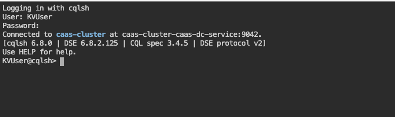
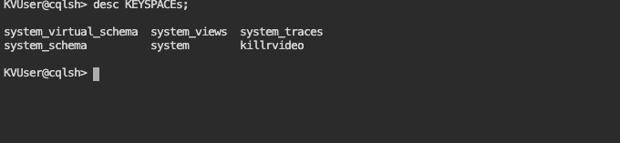
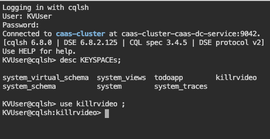
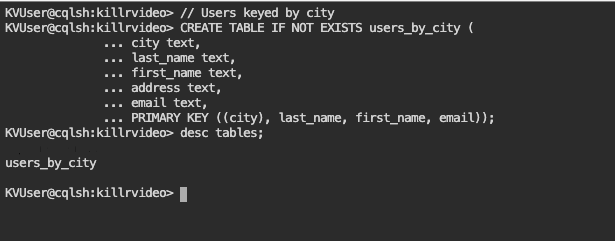
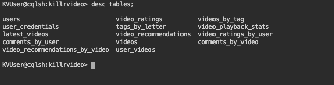
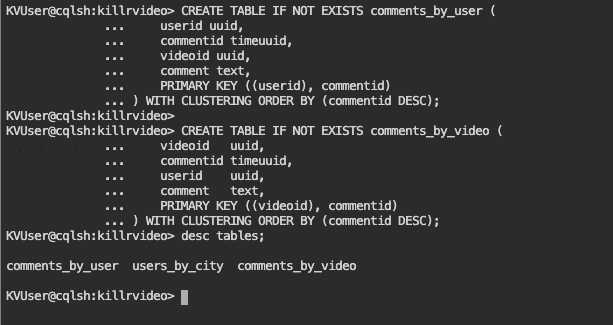
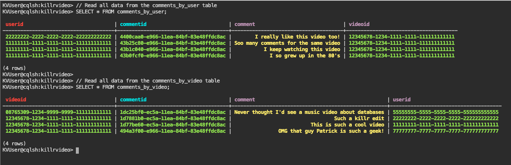
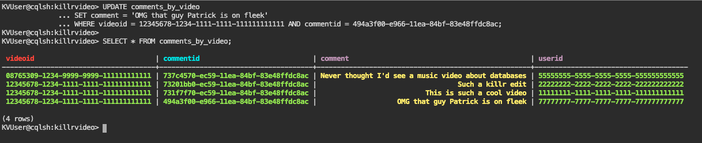
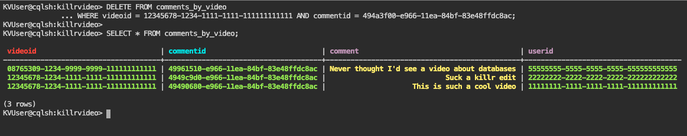

## 🎓🔥 KillrVideo App - Hands-on com Cassandra🔥🎓

Este material foi baseado no [DataStax Workshop](https://github.com/datastaxdevs/workshop-intro-to-cassandra) usando o caso de uso da aplicação KillrVideo.
A descrição do modelo original pode ser encontrado no white paper Data Modeling in Apache Cassandra, [link](https://www.datastax.com/resources/whitepaper/data-modeling-apache-cassandra). 


## Table of Contents

| Title  | Description
|---|---|
| **1. Create a table** | [Create a table](#1-create-a-table) |
| **2. Execute CRUD (Create, Read, Update, Delete) operations** | [Execute CRUD operations](#2-execute-crud-operations) |


## 1. Create a table
Ok, now that you have a database created the next step is to create a table to work with. 

**✅ Step 2a. Start the CQL shell**

```
cqlsh
```



**✅ Step 2b. Create a keyspaces and USE killrvideo**
```
CREATE KEYSPACE killrvideo WITH REPLICATION = { 'class' : 'SimpleStrategy', 'replication_factor' : 1 };
```

**✅ Step 2c. Describe keyspaces and USE killrvideo**


```
describe KEYSPACES;
```

 
 





```
use killrvideo;
```

📗 **Expected output**

 

Notice how the prompt displays ```cqlsh:killrvideo>``` informing us we are **using** the **_killrvideo_** keyspace. Now we are ready to create our table.

**✅ Step 2c. Create the _users_by_city_ table**

At this point we can execute a command to create the **_users_by_city_** table using the information provided during the workshop presenation. Just copy/paste the following command into your CQL console at the prompt.


```
// Users keyed by city
CREATE TABLE IF NOT EXISTS users_by_city ( 
	city text, 
	last_name text, 
	first_name text, 
	address text, 
	email text, 
	PRIMARY KEY ((city), last_name, first_name, email));
```



Then **_DESCRIBE_** your keyspace tables to ensure it is there.

```
describe tables;
```



 
[🏠 Back to Table of Contents](#table-of-contents)

## 2. Execute CRUD operations
CRUD operations stand for create, read, update, and delete. Simply put, they are the basic types of commands you need to work with ANY database in order to maintain data for your applications.

**✅ Step 3a. Create a couple more tables**

Now we need to create some tables to support **user** and **video** comments.  

 

```
CREATE TABLE IF NOT EXISTS comments_by_user (
    userid uuid,
    commentid timeuuid,
    videoid uuid,
    comment text,
    PRIMARY KEY ((userid), commentid)
) WITH CLUSTERING ORDER BY (commentid DESC);

CREATE TABLE IF NOT EXISTS comments_by_video (
    videoid   uuid,
    commentid timeuuid,
    userid    uuid,
    comment   text,
    PRIMARY KEY ((videoid), commentid)
) WITH CLUSTERING ORDER BY (commentid DESC);
```

Then **_DESCRIBE_** your keyspace tables to ensure they are both there.

 

```
desc tables;
```

 



**✅ Step 3b. (C)RUD = create = insert data**

Our tables are in place so let's put some data in them. This is done with the **INSERT** statement. We'll start by inserting data into the **_comments_by_user_** table.

 

```
// Comment for a given user
INSERT INTO comments_by_user (
  userid, //uuid: unique id for a user
  commentid, //timeuuid: unique uuid + timestamp
  videoid, //uuid: id for a given video
  comment //text: the comment text
)
VALUES (
  11111111-1111-1111-1111-111111111111, 
  NOW(), 
  12345678-1234-1111-1111-111111111111, 
  'I so grew up in the 80''s'
);

// More comments for the same user for the same video
INSERT INTO comments_by_user (userid, commentid, videoid, comment)
VALUES (11111111-1111-1111-1111-111111111111, NOW(), 12345678-1234-1111-1111-111111111111, 'I keep watching this video');
INSERT INTO comments_by_user (userid, commentid, videoid, comment)
VALUES (11111111-1111-1111-1111-111111111111, NOW(), 12345678-1234-1111-1111-111111111111, 'Soo many comments for the same video');

// A comment from another user for the same video
INSERT INTO comments_by_user (userid, commentid, videoid, comment)
VALUES (22222222-2222-2222-2222-222222222222, NOW(), 12345678-1234-1111-1111-111111111111, 'I really like this video too!');
```

_Note, we are using "fake" generated UUID's in this dataset. If you wanted to generate UUID's on the fly just use ```UUID()``` per the documentation [HERE](https://docs.datastax.com/en/cql-oss/3.3/cql/cql_reference/timeuuid_functions_r.html)_.

Ok, let's **INSERT** more this time using the **_comments_by_video_** table.

 

```
// Comment for a given video
INSERT INTO comments_by_video (
  videoid, //uuid: id for a given video
  commentid, //timeuuid: unique uuid + timestamp
  userid, //uuid: unique id for a user
  comment //text: the comment text
)
VALUES (
  12345678-1234-1111-1111-111111111111, 
  NOW(), 
  11111111-1111-1111-1111-111111111111, 
  'This is such a cool video'
);

// More comments for the same video by different users
INSERT INTO comments_by_video (videoid, commentid, userid, comment)
VALUES(12345678-1234-1111-1111-111111111111, NOW(), 22222222-2222-2222-2222-222222222222, 'Such a killr edit');
// Ignore the hardcoded value for "commentid" instead of NOW(), we'll get to that later.
INSERT INTO comments_by_video (videoid, commentid, userid, comment)
VALUES(12345678-1234-1111-1111-111111111111, 494a3f00-e966-11ea-84bf-83e48ffdc8ac, 77777777-7777-7777-7777-777777777777, 'OMG that guy Patrick is such a geek!');

// A comment for a different video from another user
INSERT INTO comments_by_video (videoid, commentid, userid, comment)
VALUES(08765309-1234-9999-9999-111111111111, NOW(), 55555555-5555-5555-5555-555555555555, 'Never thought I''d see a music video about databases');
```

**✅ Step 3c. C(R)UD = read = read data**

Now that we've inserted a set of data, let's take a look at how to read that data back out. This is done with a **SELECT** statement. In its simplist form we could just execute a statement like the following **_**cough_** **_**cough_**:
```
SELECT * FROM comments_by_user;
```

You may have noticed my coughing fit a moment ago. Even though you can execute a **SELECT** statement with no partition key definied this is NOT something you should do when using Apache Cassandra. We are doing it here for illustration purposes only and because our dataset only has a handful of values. Given the data we inserted earlier a more proper statement would be something like:
```
SELECT * FROM comments_by_user WHERE userid = 11111111-1111-1111-1111-111111111111;
```

The key is to ensure we are **always selecting by some partition key** at a minimum.

Ok, so with that out of the way let's **READ** the data we _"created"_ earlier with our **INSERT** statements.

 

```
// Read all data from the comments_by_user table
SELECT * FROM comments_by_user;

// Read all data from the comments_by_video table
SELECT * FROM comments_by_video;
```
   

Once you execute the above **SELECT** statements you should see something like the expected output above. We have now **READ** the data we **INSERTED** earlier. Awesome job!

_BTW, just a little extra for those who are interested. Since we used a [TIMEUUID](https://docs.datastax.com/en/cql-oss/3.3/cql/cql_reference/timeuuid_functions_r.html) type for our **commentid** field we can use the **dateOf()** function to determine the timestamp from the value. Check it out._

```
// Read all data from the comments_by_user table, 
// convert commentid into a timestamp, and label the column "datetime"
select userid, dateOf(commentid) as datetime, videoid, comment from comments_by_user;
```


**✅ Step 3d. CR(U)D = update = update data**

At this point we've **_CREATED_** and **_READ_** some data, but what happens when you want to change some existing data to some new value? That's where **UPDATE** comes into play.

Let's take one of the records we created earlier and modify it. If you remember earlier we **_INSERTED_** the following record in the **comments_by_video** table.
```
INSERT INTO comments_by_video (
  videoid, 
  commentid, 
  userid, 
  comment
)
VALUES(
  12345678-1234-1111-1111-111111111111, 
  494a3f00-e966-11ea-84bf-83e48ffdc8ac, 
  77777777-7777-7777-7777-777777777777, 
  'OMG that guy Patrick is such a geek!'
);
```

Let's also take a look at the **comments_by_video** table we created earlier. In order to **UPDATE** an existing record we need to know the primary key used to **CREATE** the record.
```
CREATE TABLE IF NOT EXISTS comments_by_video (
    videoid   uuid,
    commentid timeuuid,
    userid    uuid,
    comment   text,
    PRIMARY KEY ((videoid), commentid)
) WITH CLUSTERING ORDER BY (commentid DESC);
```
So looking at ```PRIMARY KEY ((videoid), commentid)``` both **videoid** and **commentid** are used to create a unique row. We'll need both to update our record. 

_You may remember that I also glossed over the fact we used a hardcoded value for **commentid** when we created this record. This was done to simulate someone editing an existing comment for a video in our application. Imagine the UX for such a need. At the point a user clicks the "edit" button information for our **videoid** and **commentid** are provided in order to **UPDATE** the record._

We have the information that we need for the update. With that, the command is easy.

 

```
UPDATE comments_by_video 
SET comment = 'OMG that guy Patrick is on fleek' 
WHERE videoid = 12345678-1234-1111-1111-111111111111 AND commentid = 494a3f00-e966-11ea-84bf-83e48ffdc8ac;

SELECT * FROM comments_by_video;
```


 

That's it. All that's left now is to **DELETE** some data.

**✅ Step 3e. CRU(D) = delete = remove data**

The final operation from our **CRUD** acronym is **DELETE**. This is the operation we use when we want to remove data from the database. In Apache Cassandra you can **DELETE** from the cell level all the way up to the partition _(meaning I could remove a single column in a single row or I could remove a whole partition)_ using the same **DELETE** command.

_Generally speaking, it's best to perform as few delete operations as possible on the largest amount of data. Think of it this way, if you want to delete ALL data in a table, don't delete each individual cell, just **TRUNCATE** the table. If you need to delete all the rows in a partition, don't delete each row, **DELETE** the partition and so on._

For our purpose now let's **DELETE** the same row we were working with earlier.

 

```
DELETE FROM comments_by_video 
WHERE videoid = 12345678-1234-1111-1111-111111111111 AND commentid = 494a3f00-e966-11ea-84bf-83e48ffdc8ac;

SELECT * FROM comments_by_video;
```
 



Notice the row is now removed from the comments_by_video table, it's as simple as that.


